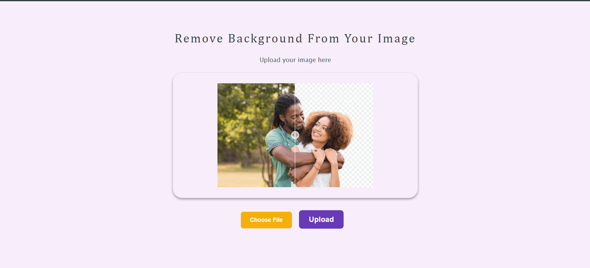

# Background Remover App

This app is a background remover app that uses OpenCV to remove the background from an image or video. It is a simple app that uses the OpenCV library to remove the background from an image or video.

## Usage

To use the app, simply drag and drop an image or video file onto the app. The app will then remove the background from the image or video and display the resulting image or video.

# Screenshots

## Installation

To install the app, simply download the app from the GitHub repository and run the app in your browser.

